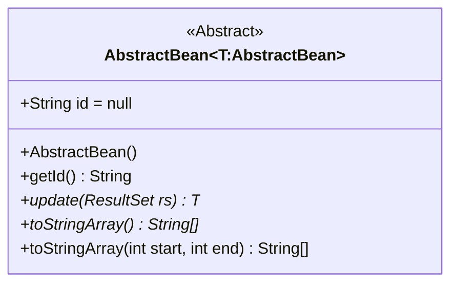
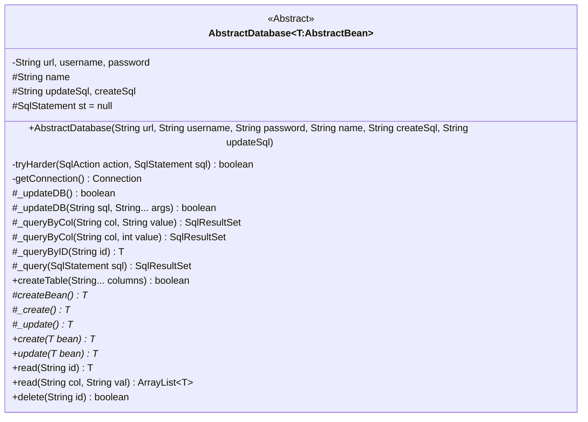
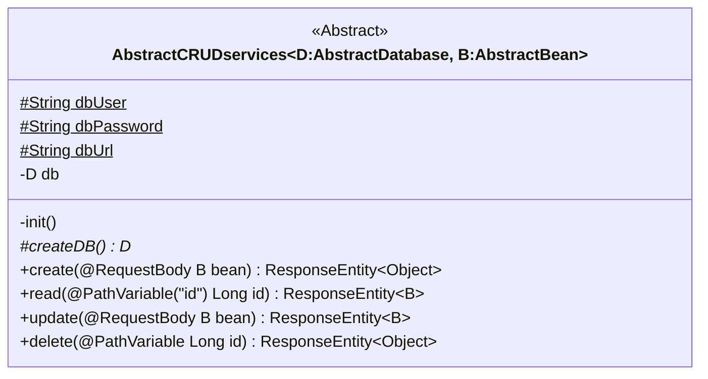

# ITP4511 Assignment
target user: members and potential customers.
Language: Java, JavaScript

## Description
This project is built to handle part of the senario mentioned in the [project brief](IT4511_Project-Brief_AY2223_V1.1.pdf).

### Usage Requirements:
| Member |
| ------------- |
| 1. Create an account, venue booking |
| 2. Guest list management |
| 3. Check personal booking records |
| 4. Update personal booking records |

### Functional Requirements:
+ <s>Venue and</s> Guest List Management
  - [X] Show a list of <s>all venue and</s> guest
  - [X] Add / edit / delete <s>venue and</s> guest
  - [ ] <s>Enable/disable listing of venue on booking system</s>
  - [X] Confirm/decline booking request
  - [ ] <s>Handle booking check-in / check-out</s>

+ Venue Booking
  - [X] Show a list of venue and related features (e.g. Image, name, type, capacity, location, description, person-in-charge, booking fee)
  - [X] Send booking request / check booking request status
  - [X] Booking reminder
  - [X] Check/ Update personal booking record
  
## Structure
### Abstraction In Java
Abstraction provides a faster implementation
                
----
#### AbstractBean

Generic type is used to make the return type of the abstract method match with its class, here is an example:
```
public class BookingBean extends AbstractBean<BookingBean>{
  ...
  @Override
    public BookingBean update(ResultSet rs) throws SQLException, IOException {
      ...
    }
  ...
}
class Func{
  
  public void func(){
    ...
    BookingBean b = new BookingBean().update(rs);
    ...
  }
}
```
                
----
#### AbstractDatabase

##### Catching Error With Action Interface
Implementation:
```
interface SqlAction {
    void run() throws SQLException, IOException;
}
protected boolean tryHarder(SqlAction action, SqlStatement sql) {
    boolean status = false;
    try {
        action.run();
        status = true;
    } catch (SQLException ex) {
        while (ex != null) {
            ex.printStackTrace();
            ex = ex.getNextException();
        }
    } catch (IOException ex) {
        ex.printStackTrace();
    } finally {
        if(sql != null)
            sql.close();
    }
    return status;
}
```
In action:
```
public boolean func(){
  return tryHarder((SqlAction) () -> {
            st = new SqlStatement();
            throw new SQLException();
        }, st);
} //should return false
```
This helps to shorten the code and centralize the error logging.
                
----
#### AbstractCRUDservices

